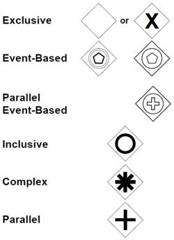

# Các loại gateway trong Camunda
Sử dụng thông tin và hình ảnh từ các nguồn:
-     

## Lưu ý:
- Gateway trong BPMN được kí hiệu bằng một hình thoi, được phân loại bằng kí hiệu chứa trong hình thoi đó.

- Gateway là điểm mà tại đó luồng xử lý của process phân nhánh.
- Để đảm bảo logic phân nhánh của một gateway, cần ít nhất hai lối ra (out-going sequence flow).
## Các Gateway được Engine hỗ trợ

- *Exclusive Gateway*: 

- *Inclusive Gateway*:
- *Parallel Gateway*:
- *Event-based gateway*:

## Các Gateway không được Engine hỗ trợ

- *Complex Gateway*:
- *Exclusive Event-based gateway*:
- *Inclusive Event-based gateway*: