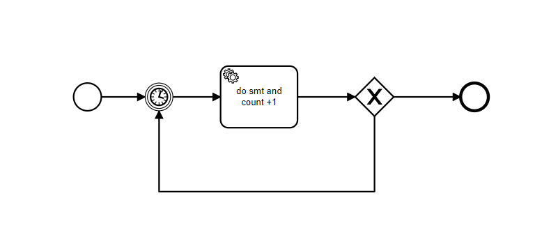

# *DEMO*:: Lặp serviceTask 15s/lần -- tối đa 5 lần.

## *Cần có:
- URL: http://localhost:8088/void-create
- Method: Post
- Request Body: {
  "processKey" : "repeatAServiceTask",
  "variables":{
  "count": 0
  }
  }
- Thành Phần trong Request Body:
1. processKey : id định danh của file bpm chứa process cần khởi tạo
2. variables : các biến muốn thêm vào process (ở Demo này ta sẽ thêm biến "count" này ngay từ khi khởi tạo process)

## *Mô tả:
- Đây là mình họa của process:
- Khi gọi Request trên, Engine sẽ khỏi tạo 1 processInstance của "repeatAServiceTask".
- Đồng thởi đẩy 1 biến có tên "count" với giá trị bằng 0, làm global variable của process đó.
- Process tự động chạy cho đến khi gặp *Intermediate timer catch events* thì sẽ vào trạng thái chờ cho đến khi timer điểm thời gian (ở demo này đã hẹn trước là sau 15s) thì sẽ cho process đi tiếp.
- Đến serviceTask, ta sẽ tăng biến count++ để xét biến này ở ExclusiveGateway:
1. Trường hợp 1: Khi biến count < 5, process sẽ quay về *Intermediate timer catch events* để tiếp tục vòng lặp.
2. Trường hợp 2: Khi biến count == 5, process sẽ kết thúc.
